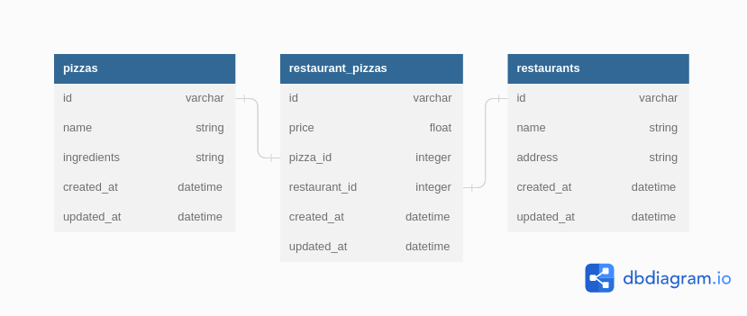

# PIZZAS - RESTAURANTS API
******

Api that associates pizzas with restaurants.

## Technologies

*****
## Entity Relationships Diagram

    

*****
## Models

### Pizza

|cid  |name         |type         |notnull  |dflt_value|pk |
|-----|-------------|-------------|---------|----------|---|
|0    |id           |INTEGER      |1        |          | 1 |
|1    |name         |varchar      |0        |          | 0 |
|2    |ingredients  |varchar      |0        |          | 0 |
|3    |created_at   |datetime(6)  |1        |          | 0 |
|4    |updated_at   |datetime(6)  |1        |          | 0 |

### Restaurant

|cid  |name         |type         |notnull  |dflt_value|pk |
|-----|-------------|-------------|---------|----------|---|
|0    |id           |INTEGER      |1        |          | 1 |
|1    |name         |varchar      |0        |          | 0 |
|2    |address      |varchar      |0        |          | 0 |
|3    |created_at   |datetime(6)  |1        |          | 0 |
|4    |updated_at   |datetime(6)  |1        |          | 0 |

### RestaurantPizza

|cid  |name         |type         |notnull  |dflt_value|pk |
|-----|-------------|-------------|---------|----------|---|
|0    |id           |INTEGER      |1        |          | 1 |
|1    |price        |FLOAT        |0        |          | 0 |
|2    |pizza_id     |INTEGER      |0        |          | 0 |
|3    |restaurant_id|INTEGER      |0        |          | 0 |
|4    |created_at   |datetime(6)  |1        |          | 0 |
|5    |updated_at   |datetime(6)  |1        |          | 0 |

*****
## Endpoints
|           Prefix |Verb   |URI Pattern                      |Controller#Action         |
|-----------------:|-------|---------------------------------|--------------------------|
|restaurant_pizzas |GET    |/restaurant_pizzas(.:format)     |restaurant_pizzas#index   |
|                  |POST   |/restaurant_pizzas(.:format)     |restaurant_pizzas#create  |
| restaurant_pizza |GET    |/restaurant_pizzas/:id(.:format) |restaurant_pizzas#show    |
|                  |PATCH  |/restaurant_pizzas/:id(.:format) |restaurant_pizzas#update  | 
|                  |PUT    |/restaurant_pizzas/:id(.:format) |restaurant_pizzas#update  |
|                  |DELETE |restaurant_pizzas/:id(.:format)  |restaurant_pizzas#destroy |
|           pizzas |GET    |/pizzas(.:format)                |pizzas#index              |
|                  |POST   |/pizzas(.:format)                |pizzas#create             |
|            pizza |GET    |/pizzas/:id(.:format)            |pizzas#show               |
|                  |PATCH  |/pizzas/:id(.:format)            |pizzas#update             |
|                  |PUT    |/pizzas/:id(.:format)            |pizzas#update             |
|                  |DELETE |/pizzas/:id(.:format)            |pizzas#destroy            |
|      restaurants |GET    |/restaurants(.:format)           |restaurants#index         |
|                  |POST   |/restaurants(.:format)           |restaurants#create        |
|       restaurant |GET    |/restaurants/:id(.:format)       |restaurants#show          |
|                  |PATCH  |/restaurants/:id(.:format)       |restaurants#update        |
|                  |PUT    |/restaurants/:id(.:format)       |restaurants#update        |
|                  |DELETE |/restaurants/:id(.:format)       |restaurants#destroy       |

******

## Author
[ Erick Obuya &copy; 2023](https://github.com/erick-sudo)
## License
    
    MIT License Copyright (c) [2023] Erick Obuya. All rights reserved.

**********
